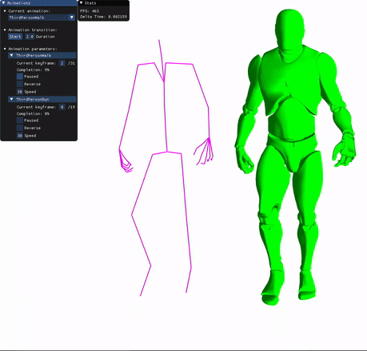
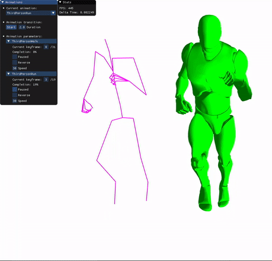
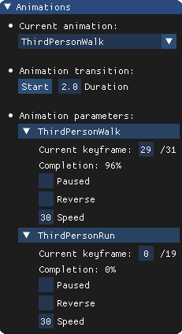

# Animation Programming

This project was made for the ISART Digital school by Rémi Serra and an anonymous collaborator. <br>
The goal was to understand how animation works in video games and to learn the mathematical and structural challenges behind it.

<br>

## Preview
  <br>
 

<br>

## Features

- Skeleton made up of bones stored in tree organization
- Animation:
    - Iteration through the animation keyframes
    - Interpolation between previous and current keyframes
- Mesh skinning (to apply skeleton transforms to the mesh)
- Animation transition

<br>

## Build and run
```
Visual Studio > Debug x86 > Local Windows Debugger
```
