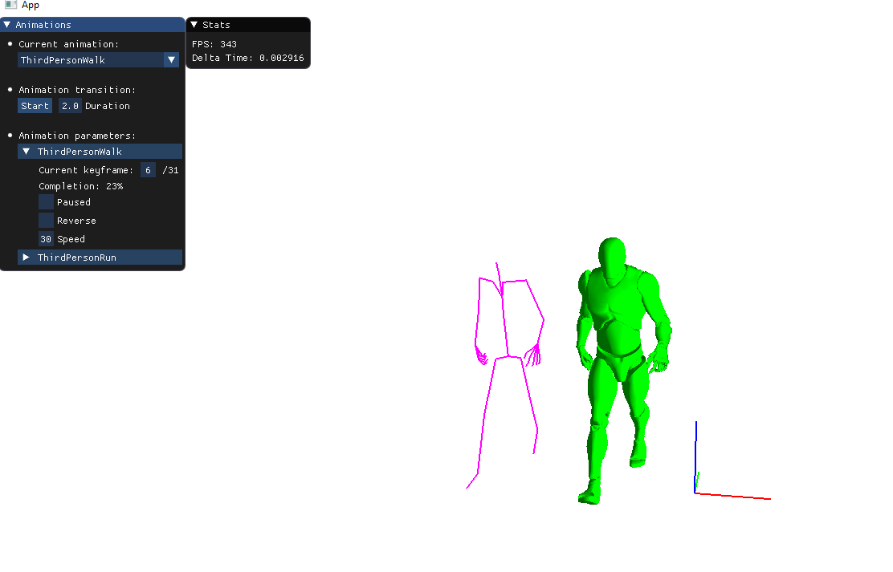
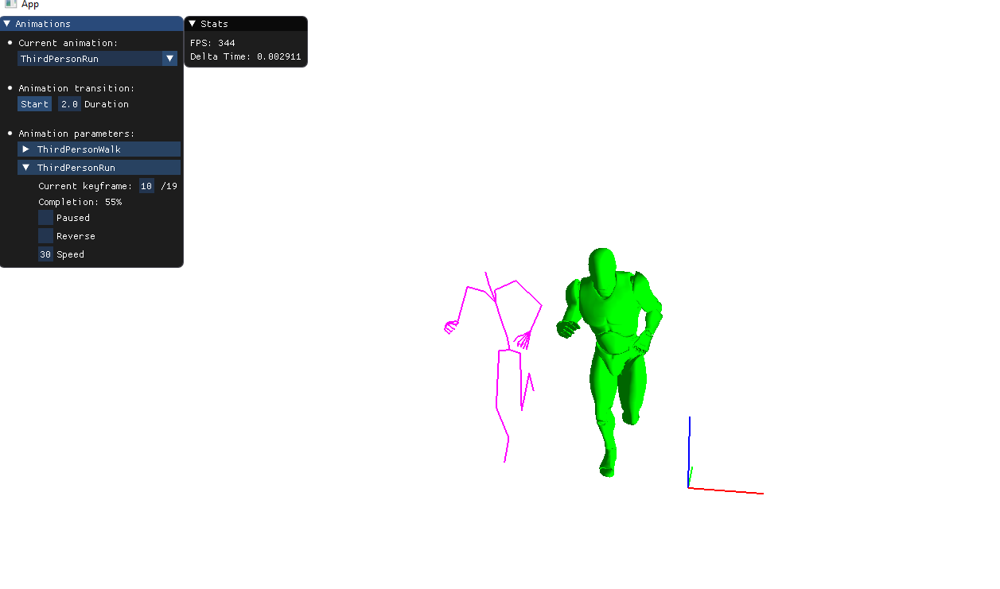
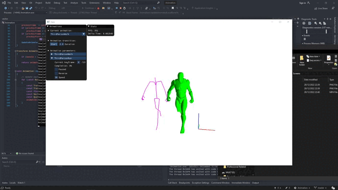
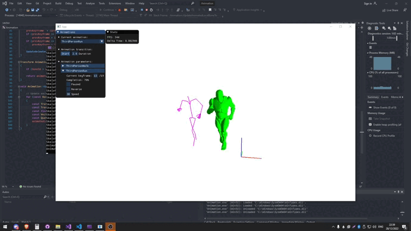

<div align="center">

# Animation Programming
</div>

**This project aims at understanding how animation works in video games.**<br/>
**The second goal of this project was to learn the mathematics challenges behind it as well as using a weird engine.**

## Information
Project start : 09/12/2022 <br>
Project end : 02/01/2023 <br>
Version : 1.0 - GOLD <br>
Date last version : 02/01/2023

## Building
## Create an executable
```sh
$ Visual Studio > Debug x86 > Local Windows Debugger
```
## Run
```sh
$ Visual Studio > Debug x86 > Local Windows Debugger
```
## Preview
# WALK PREVIEW
- 
# RUN PREVIEW
- 

# GLOBAL LOOK
- 
# BLENDING RUN -> WALK
- 

## Engine Credits
---------------
- Thank to isart professor for the base engine, very funny and best engine ever made fosho m8!